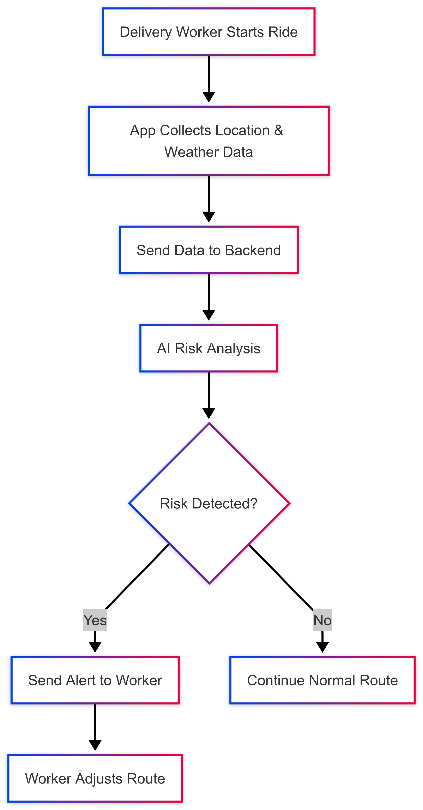
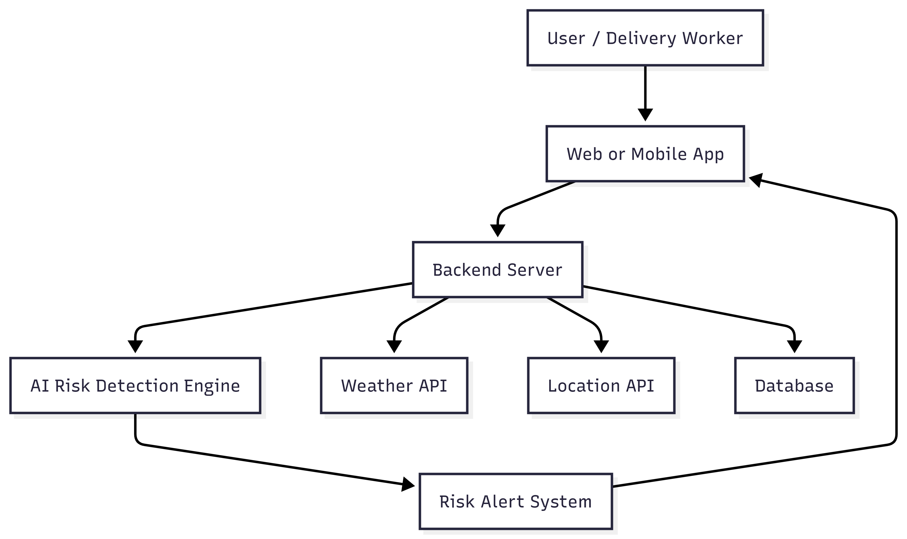
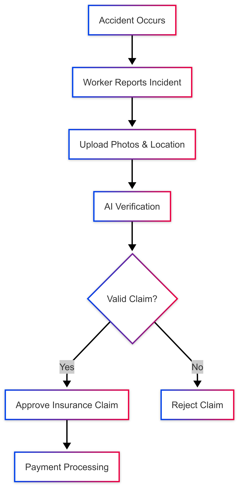

## Inspiration

India’s gig economy delivery partners working with platforms like Swiggy, Zomato, and Zepto depend heavily on daily earnings. However, external disruptions such as heavy rainfall, extreme heat, pollution spikes, and sudden curfews can reduce their working hours significantly, leading to a loss of 20–30% of their weekly income.

These challenges inspired us to build a solution focused on **income protection instead of traditional insurance**, creating a smart and automated safety net for gig workers.

---

## What it does

GigShield AI is an **AI-powered parametric insurance platform** that protects gig workers from income loss caused by external disruptions.

The system monitors real-time environmental conditions like weather and air quality. When predefined thresholds are crossed, it automatically detects disruptions, estimates income loss, and triggers **instant payouts**, eliminating the need for manual claims.

---

## System Architecture

User → Frontend (React) → Backend (Spring Boot) → AI Engine (Python) → External APIs (Weather, AQI) → Decision Engine → Payout System

---

## How we built it

We built GigShield AI using a modern full-stack architecture:

* **Frontend:** React (Dark SaaS Dashboard UI)
* **Backend:** Spring Boot (Java)
* **Database:** MySQL
* **AI/ML:** Python (Scikit-learn, Pandas)
* **APIs:** OpenWeatherMap API, AQI API
* **Payments:** Razorpay (Test Mode)

We integrated AI-based risk scoring with parametric triggers to automate claim processing.

---

###  System Workflow

This workflow shows how user data flows through the system—from input collection to AI-based risk analysis and automated payout processing.

---

###  System Architecture

The architecture represents the interaction between frontend, backend, AI engine, and external APIs, ensuring a scalable and real-time processing system.

###   System Auto Claim Flow

This diagram illustrates how the system automatically detects disruptions, verifies conditions, calculates income loss, and triggers instant payouts without manual claims.

---

## AI/ML Strategy

We use machine learning models to predict disruption risk:

* **Models:** Logistic Regression, Random Forest
* **Input Features:**

  * Rainfall data
  * AQI levels
  * Historical order patterns
* **Output:**

  * Risk Score (0–100%)

This enables **data-driven and automated claim decisions**.

---

## Data Sources & Threshold Logic

We use:

* OpenWeatherMap API → Rainfall data
* AQI API → Air Quality Index

### Thresholds:

* Rainfall > 60mm → High disruption
* AQI > 300 → Unsafe working conditions

These thresholds are based on environmental safety benchmarks and observed drops in delivery activity.

##  Disruption Triggers

| Disruption | Trigger Condition |
|-----------|------------------|
| Heavy Rain | Rainfall > 60mm |
| Extreme Heat | Temperature > 45°C |
| Severe Pollution | AQI > 400 |
| Zone Closure | Curfew or access restriction |

---

## Income Loss Calculation

$$
\text{Income Loss} = \text{Average Hourly Earnings} \times \text{Hours Lost}
$$

$$
\text{Average Hourly Earnings} = \frac{\text{Daily Earnings}}{\text{Working Hours}}
$$

---

## Example Scenario

* Location: Delhi
* Rainfall: 75mm
* AQI: 320
* Risk Score: 85%

### System Action:

* Threshold exceeded
* Claim automatically triggered
* Estimated Income Loss: ₹800
* Instant payout processed

---

## Adversarial Defense & Anti-Spoofing Strategy

To prevent fraud and misuse:

* **GPS Validation:** Ensures user is present in affected area
* **Platform Activity Check:** Verifies reduced order activity
* **Multi-API Verification:** Cross-checks environmental data
* **AI-based Anomaly Detection:** Detects unusual claim behavior
* **Time Validation:** Matches disruption with working hours

This ensures a **secure and fraud-resistant system**.

---

## Financial Viability

GigShield AI follows a sustainable weekly premium model.

### Example:

* Weekly Income: ₹6000
* Risk Probability: 20%
* Expected Loss: ₹1200

$$
\text{Premium} = \text{Expected Loss} + \text{Platform Fee}
$$

$$
= 1200 + 10% = ₹1320
$$

This ensures:

* Sustainable revenue
* Risk coverage
* Scalability
---
## Subscription Plans & Coverage

| Plan | Weekly Premium | Coverage |
|------|---------------|---------|
| Basic | ₹20 | Up to ₹2000 income loss |
| Standard | ₹40 | Up to ₹4000 income loss |
| Pro | ₹60 | Up to ₹6000 income loss |

---

## Coverage & Exclusions

### Covered:

* Heavy rainfall
* Extreme heat
* High AQI levels
* Government restrictions

### Excluded:

* Personal illness
* Voluntary absence
* Device/network issues
* War and pandemic events

---

## Regulatory Considerations

GigShield AI aligns with IRDAI guidelines for parametric insurance:

* Transparent payout triggers
* Predefined conditions
* No claim assessment delay

Future scope includes partnerships with licensed insurers.

---

## UI Preview

---

## Why GigShield AI Stands Out

* Fully automated claim system (zero manual effort)
* AI-driven risk prediction
* Faster than traditional insurance models
* Focused on gig workers (underserved segment)
* Real-time environmental data integration

---

## Challenges we ran into

* Designing a fair pricing model
* Simulating real-time data
* Building a zero-touch system
* Fraud prevention
* Balancing UI simplicity and functionality

---

## Accomplishments that we're proud of

* Built a parametric insurance prototype
* Implemented AI-based risk scoring
* Developed automated claim system
* Designed modern SaaS UI
* Created real-world impact solution

---

## What we learned

* Parametric insurance fundamentals
* AI in risk prediction
* Full-stack system design
* API integration
* User-centric design

---

## What's next for GigShield AI

* Hyperlocal AI risk prediction
* Integration with gig platforms
* GPS-based fraud detection
* Predictive disruption alerts
* Expansion across India

---

## Vision

GigShield AI aims to protect millions of gig workers by creating a real-time, AI-powered financial safety net.

---

## Built With

* React
* Spring Boot
* MySQL
* Python
* Scikit-learn
* Pandas
* OpenWeatherMap API
* AQI API
* Razorpay

---

